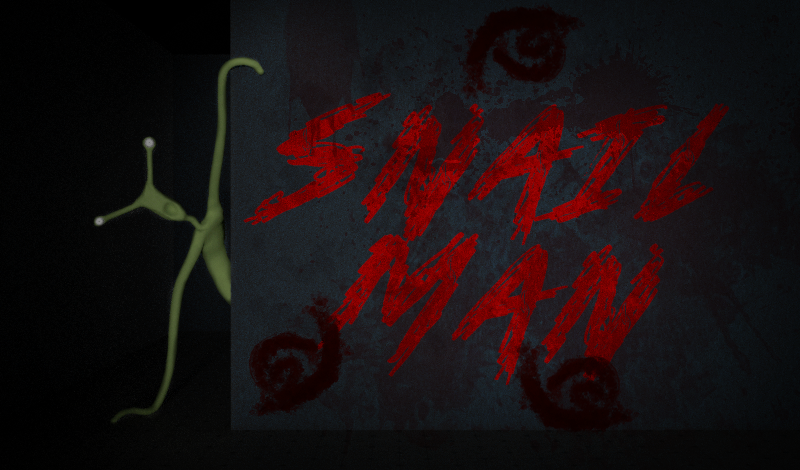
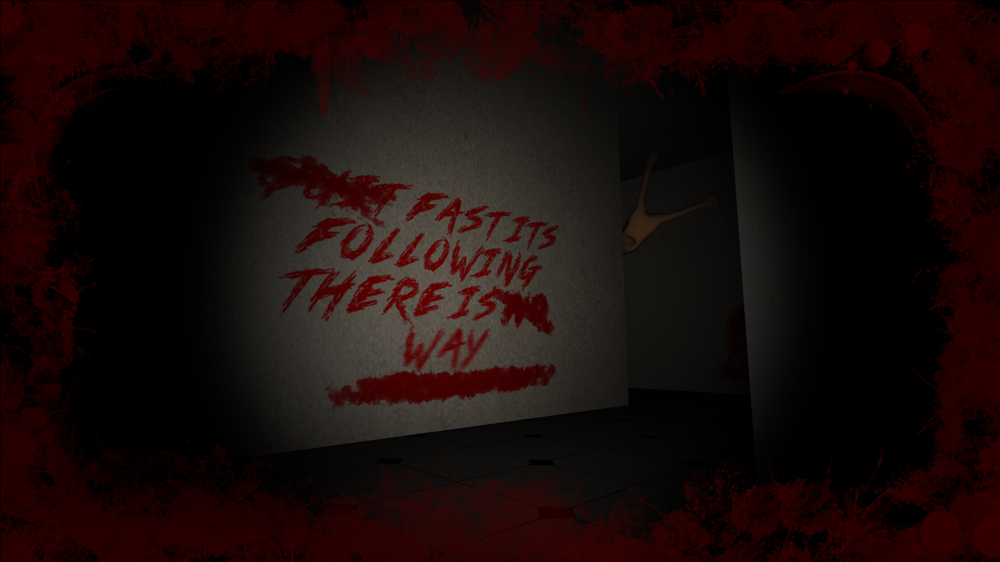

# SnailMan

Снеилмен ищет тебя в лабиринте. Найди выход прежде чем оно доберется до тебя!
---

## Об игре
SnailMan – это хоррор игра про жуткое существо – человека-улитку, с которым игрок заперт в темном лабиринте. Необходимо выбраться из него как можно скорее, установив скоростной рекорд среди других игроков.

Также в лабиринте будут встречаться различные объекты: оружие и ловушки, влияющие на геймплей. Оружием можно на некоторое оглушить человека-улитку, однако для этого необходимо найти снаряд. Ловушки же мешают игроку, замедляя его/давая информацию человеку-улитке от расположении игрока.

### Игровой цикл
Игрок появляется в начале лабиринта, цель игровой сессии - найти выход. Для этого он может использовать вспомогательные инструменты - оружие, либо же составлять оптимальный маршрут. У снеилмена есть три маршрута патрулирования, которые зависят от расположения игрока в лабиринте, чем ближе игрок к выходу, тем "агрессивнее" человек-улитка. Время прохождения лабиринта записывается в рекорды игрока и лидерборд, таким образом игроки могут соревноваться между собой. 
### Управление
#### Управление на ПК:
+ Передвижение: WASD;
+ Управление камерой: Мышь;
+ Бег: Shift (Во время бега издается звук, на который вскоре придет человек-улитка, расходуется выносливость);
+ Выстрел: ЛКМ (Левая Кнопка Мыши);
+ Панель настроек: Tab.
#### Управление на мобильных устройствах:
Осуществляется с помощью джойстика и кнопок, появляющихся на экране.
___
+ Движок: Unity;
+ Платформы: Windows, Android, WebGL;
+ YandexSDK: Интегрирован.
___
Игра снята с публикации

